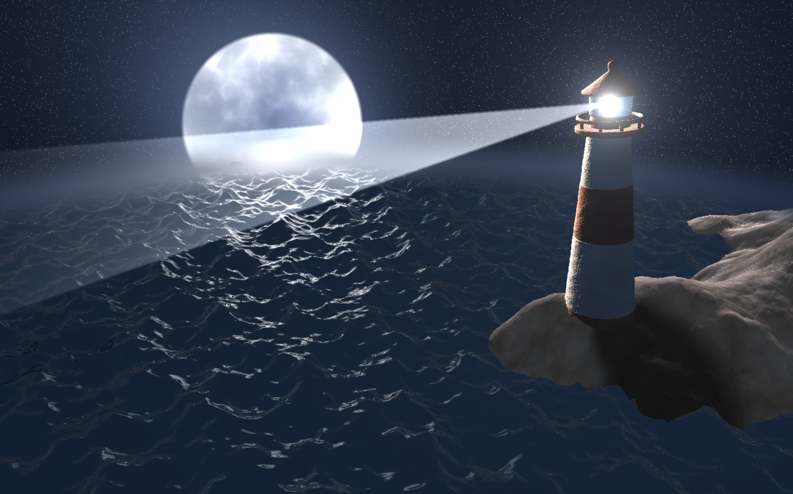
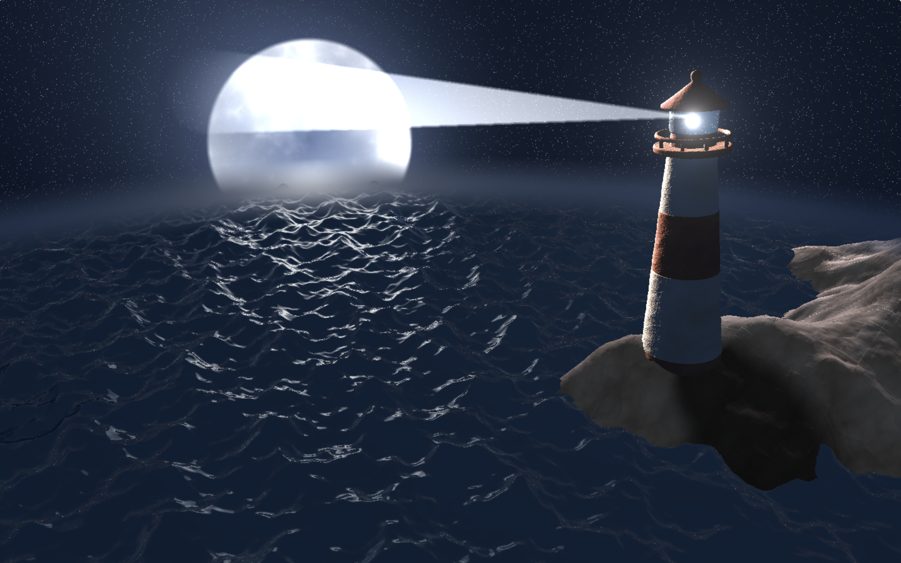

# Environment Setpiece

Spring 2020  
Iciar Andreu Angulo  
PennKey: iciar  
Demo: https://www.shadertoy.com/view/WtcSDf

## Main Features
For this project I created a night scene of a lighthouse using Signed Distance Functions and noise functions.
- **Geometry**: the geometry was done using a combination of simpler SDF functions, mainly caped cones, sometimes combined using smooth blend. In order to improve performance, I created a bounding box around the lighthouse to check if the ray is going to hit any part of it at all while ray marching.
- **Shading/Texturing**: the shading is done using different noise functions, including different fbms and Worley noise. The surface is defuse and specular, giving it a glossy look.
    * **Lighthouse**: warped fbms are used to give it the wore done look, in addition to adding a "normal map" to the geometry to match the texture and reduce the smoothness of the surface.
    * **Terrain**: also an fbm is used to create the terrain, the color is used by the colors using two different fbms. The shadow from the lighthouse is done by shooting a shadow ray from the intersection with the terrain to the position of the moon and checking if it hits the lighthouse.
    * **Water**: the water is created by using a special fbm which has its values modified based on time within the fbm for loop. This creates the movement of the waves. The color is done by using the reflection of the normal of the water to check if it intersects with the moon, and if so the reflection is made brighter.
    * **Sky**: pure randomness is used to create the stars, clamping the value so that there are not as many. The moon is created using the distance from the center of the moon to generate the radius of the circle of a different color, in this case a mix of the sky color and pure white using an fbm as the t value of the interpolation.
- **Animation**: The animation includes the movement of the ocean waves, the rotation of the beam of light from the lighthouse, and the blinking of the lighthouse light based in where the beam is pointing at.   
   

## ShaderToy Implementation
Use BufferA.txt and BufferB.txt as your buffers in ShaderToy and use Image.txt as the main image. Then, in the main image set BufferA as iChannel0 and BufferB as iChannel1.

## Resources
- http://www.iquilezles.org/www/articles/distfunctions/distfunctions.htm
- https://www.shadertoy.com/view/Xds3zN
- https://www.iquilezles.org/www/articles/rmshadows/rmshadows.htm
- https://www.shadertoy.com/view/MdX3Rr
- https://www.shadertoy.com/view/MlfXWH
- https://www.shadertoy.com/view/XdsGDB
- https://www.shadertoy.com/view/Xds3zNs
- https://www.iquilezles.org/www/articles/outdoorslighting/outdoorslighting.htm
- https://www.shadertoy.com/view/MdyGzR
